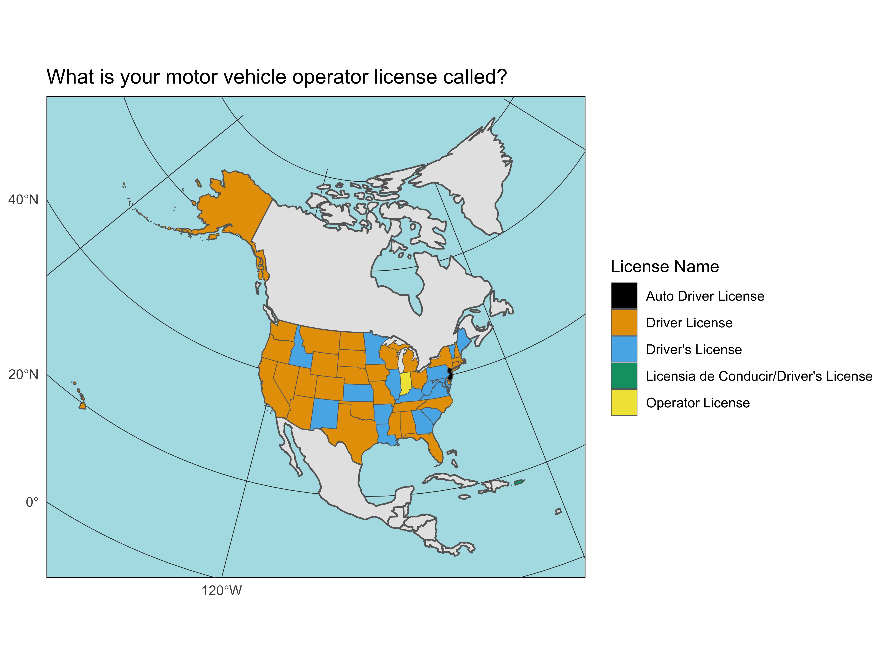

# statewiseDL
Data and plot of motor vehicle license terminology by state

## Data access
Data were generated by searching "STATEHERE driver license" on Google Images and looking at motor vehicle operator licenses for that state. In general, most of the top image search results used the same title, within state. License names along with corresponding state names were entered manually in Excel.

## Data plotting
Data were plotted using R and the sf and ggplot2 libraries. 

## The result
Here is the plot generated using the script in /code/:

